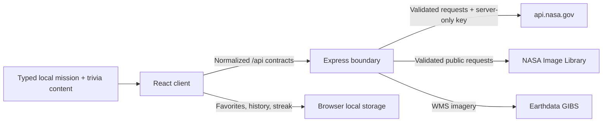
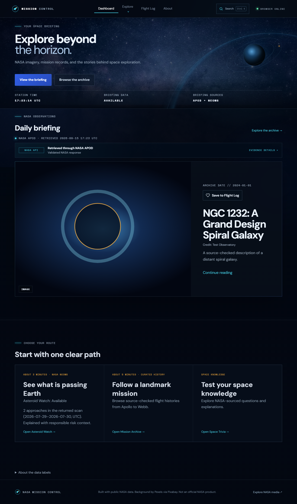
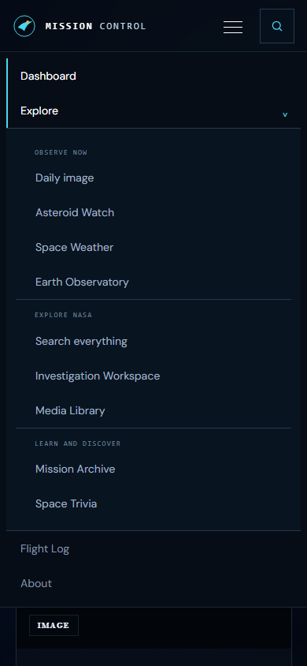
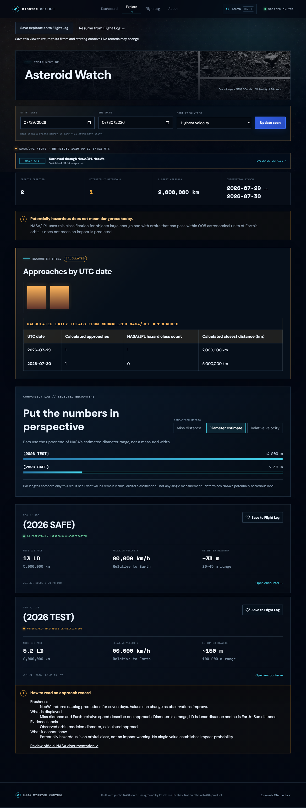
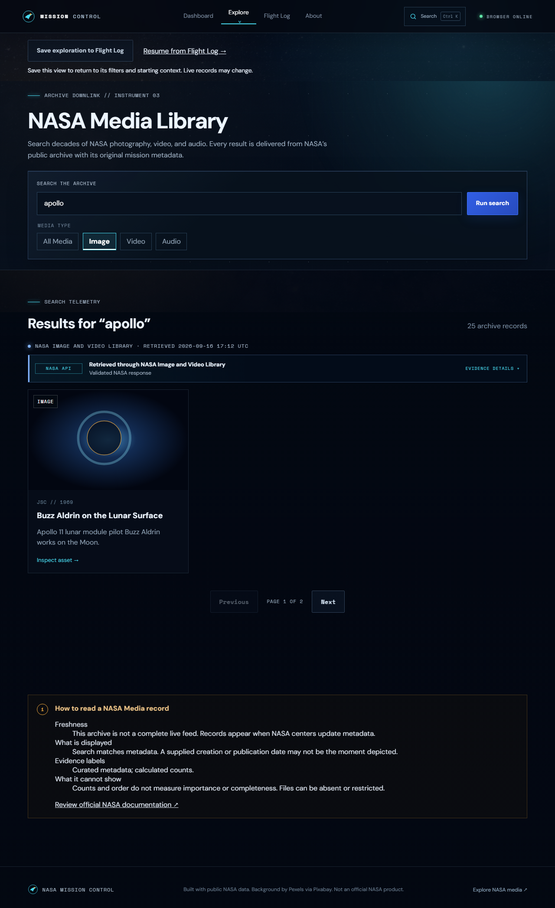
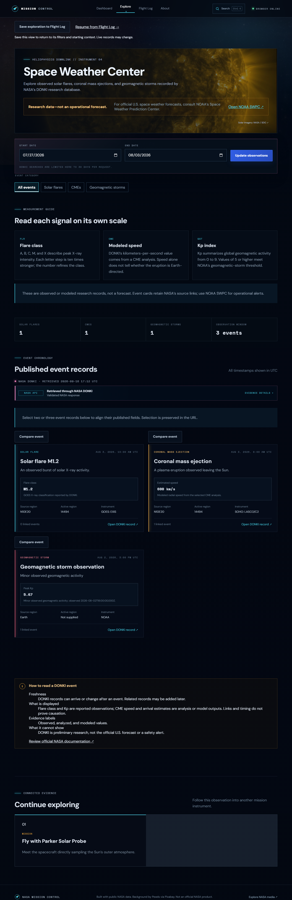
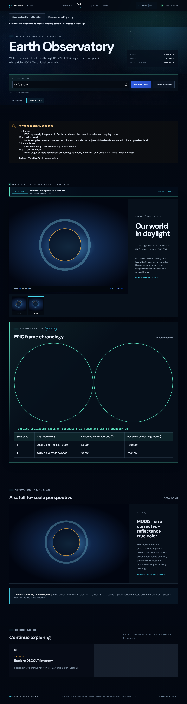
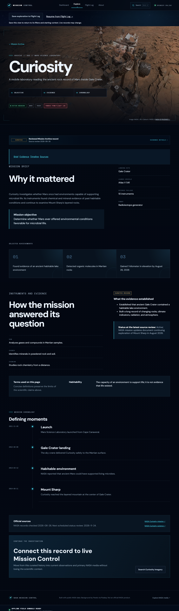
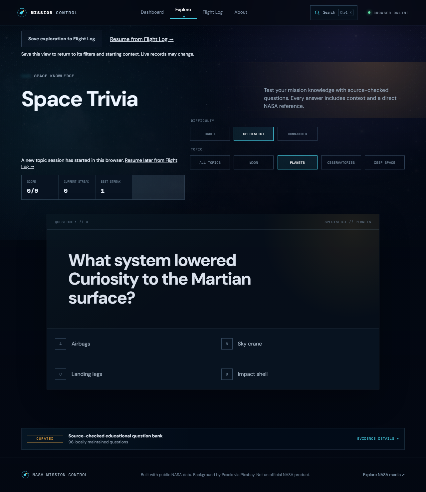

# NASA Mission Control

An original, responsive command-center experience for exploring NASA imagery and space science. The current release combines live and frequently updated NASA data with a source-checked Mission Archive, a multi-content personal Flight Log, and an educational trivia simulation.

> Portfolio project; not affiliated with or endorsed by NASA.

## Current features

- Responsive application shell with accessible desktop/mobile navigation
- Mission Control dashboard and live UTC telemetry styling
- APOD image and embedded-video support with date-based shareable URLs
- Server-side NASA key, response normalization, timeout, validation, stable errors, and memory caching
- Local APOD favorites with attribution when supplied by NASA
- Loading, empty, error, and retry experiences; reduced-motion support
- Versioned favorite persistence with legacy migration and malformed-data recovery
- Security headers, structured request logs, bounded caching, and graceful shutdown
- Automated accessibility checks, Chromium smoke tests, and GitHub Actions CI
- Asteroid Watch date-range scans, sorting, telemetry, and shareable encounter pages
- Responsible NASA/JPL potentially hazardous classifications with explicit impact context
- Saved asteroid encounters alongside APOD discoveries in the Flight Log
- NASA Image and Video Library full-text search, media filters, pagination, and asset detail pages
- Responsive image, video, and audio presentation with original-asset links
- Optimized responsive Milky Way atmosphere with deliberate contrast overlays
- DONKI Space Weather Center for solar flares, CMEs, and geomagnetic storm observations
- Plain-language measurements, UTC timestamps, research disclaimers, and source links
- Earth Observatory with date-based DSCOVR EPIC natural/enhanced imagery sequences
- Keyboard-operable EPIC filmstrip, observation telemetry, and full-resolution downloads
- Daily MODIS Terra true-color global composites from Earthdata GIBS
- Curated Mission Archive spanning Apollo 11, Voyager 1, Curiosity, and Webb
- URL-backed destination, spacecraft-type, and status filters
- Cinematic mission records with timelines, achievements, NASA photography, credits, and official sources
- Expanded browser-local Flight Log for APOD, asteroids, mission records, and NASA media
- Runtime-validated recently viewed history with deduplication, bounded storage, and clear controls
- Source-checked Space Trivia with three difficulty levels, scoring, persistent best streak, explanations, and NASA citations
- Grouped, keyboard-accessible module navigation with route-aware document titles
- Route-level code splitting, self-hosted fonts, and optimized local imagery for faster repeat visits
- Credited NASA Bennu and solar imagery establishing a distinct visual identity for major live-data modules
- Visible NASA source/freshness indicators across live-data instruments
- Sanitized browser runtime-error reporting to structured Vercel function logs
- Explicit retry metadata, no-store failure responses, and transient-failure recovery coverage

## Planned modules

Optional account synchronization, deployment observability, and additional source-checked mission records. The legacy NASA Earth and Mars Rover APIs are archived and will not be used.

## Stack

React, Vite, strict TypeScript, React Router, TanStack Query, Node.js, Express, Helmet, Zod, CSS, npm workspaces, Vitest, React Testing Library, axe-core, Playwright, ESLint, and Prettier.

## Local setup

Requirements: Node.js 20.19+ and npm 10+.

```bash
npm install
cp .env.example .env
npm run dev
```

On Windows PowerShell, use `Copy-Item .env.example .env`. Open `http://localhost:5173`; the Express API runs on `http://localhost:3001` and Vite proxies `/api` during development.

## Environment variables

| Name                      | Required | Purpose                                                               |
| ------------------------- | -------- | --------------------------------------------------------------------- |
| `NODE_ENV`                | No       | Runtime mode; defaults to `development`                               |
| `NASA_API_KEY`            | Yes      | Personal api.nasa.gov key, or `DEMO_KEY` for limited local evaluation |
| `PORT`                    | No       | Express port; defaults to `3001`                                      |
| `CLIENT_ORIGIN`           | No       | Allowed development origin; defaults to `http://localhost:5173`       |
| `NASA_REQUEST_TIMEOUT_MS` | No       | Upstream timeout; defaults to `30000`                                 |
| `NASA_CACHE_TTL_MS`       | No       | In-memory NASA response cache lifetime; defaults to `300000`          |
| `NASA_CACHE_MAX_ENTRIES`  | No       | Maximum records per NASA response cache; defaults to `100`            |

`DEMO_KEY` is limited by NASA to 30 requests per hour and 50 per day per IP. Never place NASA keys in `VITE_*` variables or commit `.env`.

## Commands

```bash
npm run dev
npm run typecheck
npm run lint
npm test
npm run test:e2e
npm run build
npm run format:check
```

The first Playwright run may require `npx playwright install chromium`.

Portfolio screenshots are not rewritten during normal or CI test runs. To regenerate the deterministic captures, set `UPDATE_SCREENSHOTS=true` while running `npm run test:e2e` (or `$env:UPDATE_SCREENSHOTS="true"` first in PowerShell).

## Production run

Build all workspaces, set `NODE_ENV=production`, and start Express. The server serves both the compiled SPA and `/api` routes:

```powershell
npm run build
$env:NODE_ENV="production"
npm start
```

Open `http://localhost:3001`. Deployments must provide `NASA_API_KEY`; the client build never receives it. Any Node.js host that runs the build and start commands and preserves environment variables can use this production path.

### Vercel deployment

The root `vercel.json` builds the shared contracts and Vite client, preserves `/api/*` for the catch-all Express function, and rewrites other paths to the SPA entry point. Configure `NASA_API_KEY` as an encrypted Vercel environment variable for Production and Preview before deploying. Production client/API traffic is same-origin; `CLIENT_ORIGIN` is used only by local and test servers.

### Production monitoring

Every API request emits a structured completion record containing its request ID, method, route path, status, and duration. Unexpected server errors and sanitized browser runtime failures appear in Vercel Runtime Logs as `request.unhandled_error` and `client.runtime_error`. Client reports contain only the error category, a bounded message, and the URL pathname—never query parameters, stack traces, local-storage values, or NASA credentials.

After a deployment, verify `/api/health`, one live-data route, a lazy-loaded page, and a retry flow. Review Runtime Logs for 5xx responses and repeated `client.runtime_error` events. This lightweight baseline does not replace dedicated uptime monitoring or alerting; add those only if the project gains a production service-level target.

## Architecture



The browser calls internal endpoints such as `GET /api/apod?date=YYYY-MM-DD`, `GET /api/asteroids?startDate=YYYY-MM-DD&endDate=YYYY-MM-DD`, `GET /api/media/search?q=apollo&mediaType=image&page=1`, `GET /api/space-weather?startDate=YYYY-MM-DD&endDate=YYYY-MM-DD&category=all`, and `GET /api/earth?date=YYYY-MM-DD&collection=natural`. Express validates each query, calls NASA services, validates important upstream fields, and maps them into deliberately small internal models:

```ts
type Apod = {
  date: string;
  title: string;
  explanation: string;
  mediaType: "image" | "video";
  mediaUrl: string;
  hdUrl: string | null;
  thumbnailUrl: string | null;
  copyright: string | null;
};
```

The Earth contract contains the selected and latest available dates, normalized EPIC frames, centroid telemetry, archive URLs, and an exact GIBS WMS image URL. EPIC metadata field names and WMS configuration details do not spread through the UI. The asteroid contract contains only identity, JPL source URL, NASA classification flags, estimated diameter bounds, and the selected Earth approach’s UTC time, relative velocity, and miss distance. Dynamic NeoWs date buckets and numeric strings never reach the UI.

Mission Archive records are intentionally local, typed editorial content rather than an invented “live missions” API. Every record carries a review date, official NASA source links, exact NASA Image Library ID and credit, and a stable route at `/missions/:missionSlug`. Archive filters remain in the URL.

The Flight Log uses separate bounded, runtime-validated local-storage records for each content type. APOD and asteroid formats remain backward compatible; mission favorites store stable curated slugs, and NASA media favorites store only the normalized metadata required to render a saved card. A separate 20-item recently viewed store deduplicates APOD, asteroid, media, and mission visits. No account, database, or cross-device synchronization is implied.

Space Trivia is curated local educational content. Its question bank is divided into cadet, specialist, and commander levels, and every explanation links to the official NASA page used for verification. Only the best streak persists locally; individual answers and scores remain session state.

Errors use `{ error: { code, message, requestId } }`; server details and credentials are never returned. Shared internal contracts live in `packages/shared`, while NASA-specific schemas remain in `apps/server`.

### Performance strategy

Non-dashboard routes load as independent Vite chunks, so visitors do not download every instrument on first paint. The primary production client chunk is approximately 336 kB (107 kB gzip), down from approximately 389 kB (119 kB gzip) before route splitting. DM Sans and Space Mono are self-hosted WOFF2 files, imagery is lazy-loaded where appropriate, and the global atmosphere uses responsive WebP sources.

## Testing

`npm test` covers query and date-range validation, bounded caching, security headers, APOD, NeoWs, Collection+JSON, DONKI, Earth observation behavior, curated mission and trivia source integrity, timeout/rate-limit/non-JSON/malformed upstream responses, browser error reporting, media rendering, automated accessibility checks, trivia scoring, the UTC clock, and all local favorite stores. `npm run test:e2e` verifies dashboard loading, transient API recovery, URL-backed filters, responsive navigation, all four Flight Log content types, Space Weather filtering, the EPIC image sequence, Mission Archive navigation, and Space Trivia in Chromium.

[GitHub Actions](.github/workflows/ci.yml) runs formatting, strict types, lint, all Vitest suites, the production build, and Chromium smoke tests for pushes to `main` and pull requests.

## NASA APIs and attribution

The application uses [NASA Open APIs](https://api.nasa.gov/) for APOD and NeoWs. NASA’s official APOD service repository notes that the public hosted instance can experience downtime, so every NASA integration is treated as a fallible upstream. NASA-provided copyright attribution is displayed when present.

Asteroid measurements come from NASA/JPL through NeoWs. NASA/JPL defines a potentially hazardous asteroid using orbital proximity and absolute magnitude criteria; the classification does not mean an Earth impact is predicted. See the official [CNEOS PHA definition](https://cneos.jpl.nasa.gov/glossary/PHA.html) and [NEO FAQ](https://cneos.jpl.nasa.gov/faq/).

The active [NASA Image and Video Library API](https://images.nasa.gov/docs/images.nasa.gov_api_docs.pdf) provides search and asset manifests without an API key. Its published PDF is release 1.22.0 from January 2023, and live responses sometimes label preview images `alternate` instead of the documented `preview`; server normalization accepts both. Results can identify third-party copyright holders or people with publicity rights, so detail pages retain source metadata and link to NASA rather than making blanket reuse claims. See NASA’s [Images and Media Usage Guidelines](https://www.nasa.gov/nasa-brand-center/images-and-media/).

The global Milky Way backdrop is the Pixabay image [“Astronomy, Bright, Constellation”](https://pixabay.com/photos/astronomy-bright-constellation-dark-1867616/) by Pexels, supplied for this project and stored as optimized responsive WebP variants.

Asteroid Watch uses the NASA Image Library record [“A Region of Bennu’s Northern Hemisphere Close Up”](https://images.nasa.gov/details/2019-02-25_regolith_image_compilation), credited to NASA/Goddard/University of Arizona (`2019-02-25_regolith_image_compilation`). Space Weather uses [“Image of Sun From NASA's Solar Dynamics Observatory”](https://images.nasa.gov/details/PIA26681), credited to NASA/SDO (`PIA26681`). Both module headers link directly to their official source records.

Earth Observatory uses NASA’s active [DSCOVR EPIC API](https://epic.gsfc.nasa.gov/about/api) and official EPIC archive. EPIC operates at the Sun–Earth L1 point and generally publishes multiple full-disk frames for an available observation day; it is frequently delayed relative to the current date, so the interface labels the newest date as “latest available” rather than live. Natural-color frames are composites of adjusted spectral bands, while enhanced-color frames increase atmospheric and surface detail. Credit: NASA EPIC Team.

The global daily mosaic uses the official [NASA Earthdata GIBS](https://earthdata.nasa.gov/data/tools/gibs) WMS 1.3.0 service and the `MODIS_Terra_CorrectedReflectance_TrueColor` layer. GIBS imagery may have latency, cloud cover, or missing same-day pixels. The retired `api.nasa.gov/planetary/earth` service is intentionally not used; NASA’s API portal points Earth imagery users to GIBS instead.

Space weather observations come from NASA’s active DONKI FLR, CME, and GST endpoints. NASA/CCMC describes DONKI as preliminary experimental research information supplied as a community service, not the official U.S. operational forecast. The application links to [NOAA’s Space Weather Prediction Center](https://www.swpc.noaa.gov/) for official forecasts and to each DONKI source record for context.

Mission Archive facts and chronology are checked against official NASA mission pages for [Apollo 11](https://www.nasa.gov/mission/apollo-11/), [Voyager 1](https://science.nasa.gov/mission/voyager/voyager-1/), [Curiosity](https://science.nasa.gov/mission/msl-curiosity/), and [Webb](https://science.nasa.gov/mission/webb/). Locally stored photographs retain their NASA Image Library IDs and displayed credits: `as11-40-5903`, `PIA21741`, `PIA20603`, and `GSFC_20171208_Archive_e000356`. Active and extended mission statuses can change and must be rechecked against those sources when archive records are edited.

## Roadmap

1. **Complete:** foundation, dashboard, APOD, local flight log, and Phase 1.1 hardening.
2. **Complete:** Asteroid Watch with responsible NeoWs telemetry, encounter pages, and saved objects.
3. **Complete:** NASA Image and Video Library search, filters, pagination, detail pages, and cinematic visual foundation.
4. **Complete:** DONKI Space Weather Center with observed event chronology, filters, measurements, and research context.
5. **Complete:** Earth Observatory with date-based EPIC sequences, natural/enhanced views, and Earthdata GIBS daily composites.
6. **Complete:** curated Mission Archive with source-checked timelines, URL-backed filtering, detail records, and credited NASA photography.
7. **Complete:** expanded Flight Log for mission and media records plus source-checked Space Trivia with scoring, streaks, difficulty levels, explanations, and citations.
8. **Complete:** module-specific NASA photography, grouped accessible navigation, recent-history controls, route-level performance work, metadata, and final portfolio polish.
9. **Complete — Reliability phase 1:** stable upstream-failure mapping, retry metadata, failure-safe caching, visible data freshness, sanitized client-error telemetry, security hardening, and browser recovery coverage.
10. **Next — Data experience:** richer comparisons, explainers, and visualization for scientific measurements without overstating NASA classifications.
11. **Later:** dedicated uptime alerts, portfolio case-study material, and additional source-checked archive records.

## Screenshots

The captures below use deterministic mocked NASA content so they can be regenerated without consuming API quota.

















## License

_License selection pending. Add a project license before public distribution._
