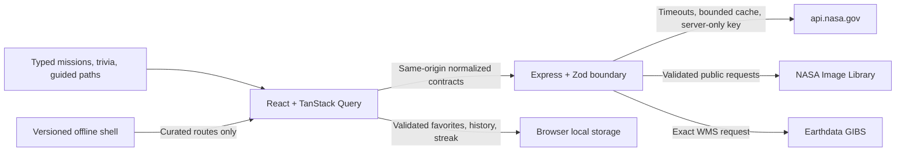
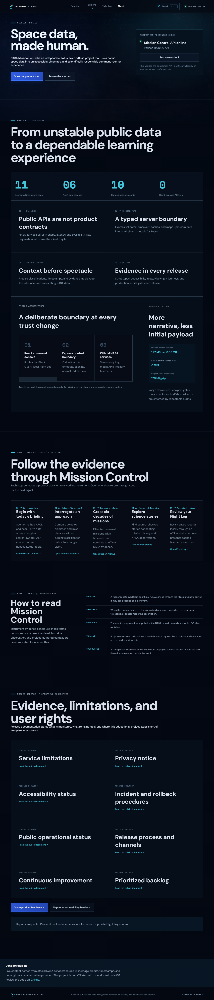

# NASA Mission Control

An original, responsive command-center experience for exploring NASA imagery and space science. The current release combines live and frequently updated NASA data with a source-checked Mission Archive, a multi-content personal Flight Log, and an educational trivia simulation.

> Portfolio project; not affiliated with or endorsed by NASA.

## Current features

- Responsive application shell with accessible desktop/mobile navigation
- Lazy-loaded global command search for keyboard-first access to instruments, missions, and discovery paths (`Ctrl+K` or `Command+K`)
- Mission Control dashboard and live UTC telemetry styling
- APOD image and embedded-video support with date-based shareable URLs
- Native playback for direct NASA video files with embedded-player support and a direct-open fallback
- Server-side NASA key, response normalization, timeout, validation, stable errors, and memory caching
- Local APOD favorites with attribution when supplied by NASA
- Loading, empty, error, and retry experiences; reduced-motion support
- Versioned favorite persistence with legacy migration and malformed-data recovery
- Security headers, structured request logs, bounded caching, and graceful shutdown
- Automated accessibility checks, Chromium smoke tests, and GitHub Actions CI
- Asteroid Watch date-range scans, sorting, telemetry, and shareable encounter pages
- Responsible NASA/JPL potentially hazardous classifications with explicit impact context
- Saved asteroid encounters alongside APOD discoveries in the Flight Log
- NASA Image and Video Library full-text search, media filters, pagination, and asset detail pages
- Responsive image, video, and audio presentation with original-asset links
- Optimized responsive Milky Way atmosphere with deliberate contrast overlays
- DONKI Space Weather Center for solar flares, CMEs, and geomagnetic storm observations
- Plain-language measurements, UTC timestamps, research disclaimers, and source links
- Earth Observatory with date-based DSCOVR EPIC natural/enhanced imagery sequences
- Keyboard-operable EPIC filmstrip, observation telemetry, and full-resolution downloads
- Daily MODIS Terra true-color global composites from Earthdata GIBS
- Ten-record curated Mission Archive spanning Apollo, Artemis, planetary exploration, heliophysics, and space observatories
- URL-backed destination, spacecraft-type, and status filters
- Destination overview groups and cinematic mission records with richer timelines, related NASA media, photography, credits, and official sources
- Shareable two- or three-mission comparison workspace with aligned flight profiles and a merged cross-mission chronology
- Celestial Scale Laboratory with source-checked reference frames, logarithmic distance and diameter comparisons, calculated one-way light time, and shareable controls
- Expandable evidence panels across live and curated instruments, with retrieval-versus-observation guidance and a shared data-literacy glossary
- Unified Discovery Index spanning instruments, missions, guided paths, browser-local Flight Log records, and normalized live NASA media results with URL-backed source filters
- Accessible solar-system mission map connecting all ten archive missions to five destination regions, defining milestones, and a structured text alternative without WebGL
- Expanded browser-local Flight Log for APOD, asteroids, guided paths, mission records, and NASA media, with URL-backed search, collection filters, sorting, summaries, and portable backups
- Runtime-validated recently viewed history with deduplication, bounded storage, and clear controls
- Twelve source-checked Space Trivia questions with three difficulty levels, four URL-backed knowledge channels, scoring, a persistent best streak, explanations, and NASA citations
- Grouped, keyboard-accessible module navigation with route-aware document titles
- Route-level code splitting, self-hosted fonts, and optimized local imagery for faster repeat visits
- Credited NASA Bennu and solar imagery establishing a distinct visual identity for major live-data modules
- Visible NASA source/freshness indicators across live-data instruments
- Sanitized browser runtime-error reporting to structured Vercel function logs
- Explicit retry metadata, no-store failure responses, and transient-failure recovery coverage
- URL-backed Asteroid Comparison Lab for miss distance, upper diameter estimate, and Earth-relative velocity
- Plain-language DONKI measurement guide separating flare class, modeled CME speed, and observed Kp activity
- Nine guided discovery paths connecting live instruments, NASA media searches, and source-checked mission history
- Contextual mission-record actions that continue into related observations and guided investigations
- Saveable guided paths with organized Flight Log collection counts and section shortcuts
- Validated, browser-local Flight Log backup and restore for user-controlled continuity without an account
- User-visible same-origin API health checks with explicit NASA-upstream scope
- Portfolio case study covering product constraints, architecture, scientific communication, and quality evidence
- Five-stop guided product tour linking portfolio decisions to working instruments
- Expanded source-checked Mission Archive with Perseverance and Parker Solar Probe
- Global offline mode messaging with route-change focus and assistive-technology announcements
- Scheduled read-only production smoke checks and a documented incident-triage runbook
- Vercel Speed Insights for route-level Core Web Vitals plus CI-enforced compressed asset budgets
- Shared Vercel CDN caching for successful public NASA responses, with live/archive freshness policies
- Daily desktop/mobile production performance audits with downloadable evidence and stability budgets
- Task-oriented first-visit routes, intent-grouped navigation, plain-language evidence onboarding, and documented privacy-conscious usability testing
- Three shareable scientific story collections connecting evidence-labeled chapters, concise chronologies, bounded claims, and current official NASA sources

## Planned modules

Optional account synchronization, deployment observability, and additional source-checked mission records. The legacy NASA Earth and Mars Rover APIs are archived and will not be used.

## Stack

React, Vite, strict TypeScript, React Router, TanStack Query, Node.js, Express, Helmet, Zod, CSS, npm workspaces, Vitest, React Testing Library, axe-core, Playwright, ESLint, and Prettier.

## Local setup

Requirements: Node.js 20.19+ and npm 10+.

```bash
npm install
cp .env.example .env
npm run dev
```

On Windows PowerShell, use `Copy-Item .env.example .env`. Open `http://localhost:5173`; the Express API runs on `http://localhost:3001` and Vite proxies `/api` during development.

## Environment variables

| Name                      | Required | Purpose                                                               |
| ------------------------- | -------- | --------------------------------------------------------------------- |
| `NODE_ENV`                | No       | Runtime mode; defaults to `development`                               |
| `NASA_API_KEY`            | Yes      | Personal api.nasa.gov key, or `DEMO_KEY` for limited local evaluation |
| `PORT`                    | No       | Express port; defaults to `3001`                                      |
| `CLIENT_ORIGIN`           | No       | Allowed development origin; defaults to `http://localhost:5173`       |
| `NASA_REQUEST_TIMEOUT_MS` | No       | Upstream timeout; defaults to `30000`                                 |
| `NASA_CACHE_TTL_MS`       | No       | In-memory NASA response cache lifetime; defaults to `300000`          |
| `NASA_CACHE_MAX_ENTRIES`  | No       | Maximum records per NASA response cache; defaults to `100`            |

`DEMO_KEY` is limited by NASA to 30 requests per hour and 50 per day per IP. Never place NASA keys in `VITE_*` variables or commit `.env`.

## Commands

```bash
npm run dev
npm run typecheck
npm run lint
npm test
npm run test:e2e
npm run screenshots:update
npm run performance:budget
npm run offline:verify
npm run audit:production
npm run smoke:production
npm run review:missions
npm run build
npm run format:check
```

The first Playwright run may require `npx playwright install chromium`.

Portfolio screenshots are not rewritten during normal or CI test runs. To regenerate the deterministic captures, set `UPDATE_SCREENSHOTS=true` while running `npm run test:e2e` (or `$env:UPDATE_SCREENSHOTS="true"` first in PowerShell).

## Production run

Build all workspaces, set `NODE_ENV=production`, and start Express. The server serves both the compiled SPA and `/api` routes:

```powershell
npm run build
$env:NODE_ENV="production"
npm start
```

Open `http://localhost:3001`. Deployments must provide `NASA_API_KEY`; the client build never receives it. Any Node.js host that runs the build and start commands and preserves environment variables can use this production path.

### Vercel deployment

The root `vercel.json` builds the shared contracts and Vite client, preserves `/api/*` for the catch-all Express function, and rewrites other paths to the SPA entry point. Configure `NASA_API_KEY` as an encrypted Vercel environment variable for Production and Preview before deploying. Production client/API traffic is same-origin; `CLIENT_ORIGIN` is used only by local and test servers.

### Production monitoring

Every API request emits a structured completion record containing its request ID, method, route path, status, and duration. Unexpected server errors and sanitized browser runtime failures appear in Vercel Runtime Logs as `request.unhandled_error` and `client.runtime_error`. Client reports contain only the error category, a bounded message, and the URL pathname—never query parameters, stack traces, local-storage values, or NASA credentials.

Successful public NASA responses use short browser caching plus targeted Vercel CDN caching. Live feeds remain fresh for five minutes at the CDN; historical APOD, dated EPIC observations, and media detail records use longer archive policies. Empty Earth observations, validation failures, upstream failures, health checks, and client-error reports are never cached. `x-cache` describes the origin function’s bounded memory cache, while Vercel’s `x-vercel-cache` header describes edge delivery. See the [cache policy](docs/caching.md) for exact limits and diagnostics.

After a deployment, verify `/api/health`, one live-data route, a lazy-loaded page, and a retry flow. The About page exposes a user-triggered, no-store check of the same-origin Express health route and carefully labels it as application availability—not proof that every NASA upstream is healthy. A scheduled GitHub workflow runs the same public health-contract and SPA-rewrite smoke checks every six hours. Review Runtime Logs for 5xx responses and repeated `client.runtime_error` events. See the [production operations runbook](docs/operations.md) for manual verification, triage, and alerting limits. This lightweight baseline does not replace third-party uptime monitoring; add that only if the project gains a production service-level target.

## Architecture



The browser calls internal endpoints such as `GET /api/apod?date=YYYY-MM-DD`, `GET /api/asteroids?startDate=YYYY-MM-DD&endDate=YYYY-MM-DD`, `GET /api/media/search?q=apollo&mediaType=image&page=1`, `GET /api/space-weather?startDate=YYYY-MM-DD&endDate=YYYY-MM-DD&category=all`, and `GET /api/earth?date=YYYY-MM-DD&collection=natural`. Express validates each query, calls NASA services, validates important upstream fields, and maps them into deliberately small internal models:

```ts
type Apod = {
  date: string;
  title: string;
  explanation: string;
  mediaType: "image" | "video";
  mediaUrl: string;
  hdUrl: string | null;
  thumbnailUrl: string | null;
  copyright: string | null;
};
```

The Earth contract contains the selected and latest available dates, normalized EPIC frames, centroid telemetry, archive URLs, and an exact GIBS WMS image URL. EPIC metadata field names and WMS configuration details do not spread through the UI. The asteroid contract contains only identity, JPL source URL, NASA classification flags, estimated diameter bounds, and the selected Earth approach’s UTC time, relative velocity, and miss distance. Dynamic NeoWs date buckets and numeric strings never reach the UI.

Mission Archive records are intentionally local, typed editorial content rather than an invented “live missions” API. Every record carries a review date, official NASA source links, a stable NASA image/resource identifier and credit, and a stable route at `/missions/:missionSlug`. Archive filters remain in the URL.

Mission comparison reuses those same curated records rather than maintaining a second source of facts. Archive selections are limited to three missions, comparison URLs preserve the selected slugs, and timeline events are merged chronologically from each record’s reviewed milestones.

The Celestial Scale Laboratory is a curated educational model, not a live ephemeris or trajectory engine. Every profile labels its origin, approximation type, and NASA source. Distances may use different reference frames when that is what the source supports; the interface warns against reading them as simultaneous positions. Signal time is calculated from the displayed distance using 299,792.458 kilometers per second, and logarithmic bars communicate orders of magnitude rather than linear spacing.

The Unified Discovery Index combines three deliberately separate channels. Instruments, curated missions, and guided paths come from a versioned local index; saved matches are read from the existing validated browser stores; and NASA media results use the normalized server search endpoint. Local and saved results render without waiting for NASA, query and source filters remain in the URL, and no cross-device index, database, or background upload is introduced.

The Flight Log uses separate bounded, runtime-validated local-storage records for each content type. APOD and asteroid formats remain backward compatible; mission and guided-path favorites store stable curated identifiers, and NASA media favorites store only the normalized metadata required to render a saved card. Saved records can be searched, filtered by collection, and sorted by title; these organization controls are preserved in the URL without changing stored data. A separate 20-item recently viewed store deduplicates APOD, asteroid, media, and mission visits. Users can export the supported records to a versioned JSON backup and restore that backup explicitly in another browser. Imports are size-limited, key-whitelisted, and processed entirely on-device; no account, database, automatic upload, or synchronization is implied.

Space Trivia is curated local educational content. Its twelve-question bank is divided into cadet, specialist, and commander levels and can be filtered into Moon, planets, observatories, and deep-space channels. Every difficulty/channel combination contains a question, and every explanation links to the official NASA page used for verification. Difficulty and category remain shareable URL state. Only the best streak persists locally; individual answers and scores remain session state.

Discovery Paths are typed, locally curated navigation narratives rather than another live API. Each path connects existing normalized data routes, NASA Image Library searches, and mission records, then links to the official NASA topic or mission page that anchors its educational context.

Errors use `{ error: { code, message, requestId } }`; server details and credentials are never returned. Shared internal contracts live in `packages/shared`, while NASA-specific schemas remain in `apps/server`.

The production build generates an installable, versioned offline field console without caching `/api` traffic. It precaches the application shell and curated route chunks, then caches same-origin static assets as they are visited. Navigation uses the latest network response when possible and falls back to the cached shell offline. Live NASA requests always go to the network, while the global connectivity notice distinguishes cached educational records from current telemetry. New service-worker versions wait for explicit user confirmation before reloading the application. Run `npm run offline:verify` after a production build to confirm every generated JavaScript and CSS asset is represented and API caching remains excluded.

### Performance strategy

Non-dashboard routes load as independent Vite chunks, so visitors do not download every instrument on first paint. With Speed Insights included, the primary production client chunk is approximately 342 kB (109 kB gzip), still below the approximately 389 kB (119 kB gzip) build measured before route splitting. DM Sans and Space Mono are self-hosted WOFF2 files, imagery is lazy-loaded where appropriate, and the global atmosphere uses responsive WebP sources.

Vercel Speed Insights records production Core Web Vitals by route without adding general-purpose visitor analytics. CI also fails if the largest compressed JavaScript asset exceeds 120 kB, all compressed JavaScript exceeds 174 kB, compressed CSS exceeds 21.5 kB, or the ten optimized Mission Archive card images exceed 400 kB in aggregate. Run `npm run build && npm run performance:budget` to reproduce the asset evidence locally; see the [performance notes](docs/performance.md) for interpretation and the optimization workflow.

A separate daily GitHub workflow runs a warmed synthetic audit against the production dashboard, Mission Archive, and Guided Discovery at desktop and mobile sizes plus the About case study and an Artemis I mission record. It fails on navigation, same-origin console/resource, application page, horizontal-overflow, transfer-size, TTFB, FCP, heading-readiness, or CLS regressions. Third-party embed failures remain in the retained diagnostic evidence without being presented as application regressions. Run `npm run audit:production` for the same read-only check locally.

## Testing

`npm test` covers query and date-range validation, bounded caching, security headers, APOD, NeoWs, Collection+JSON, DONKI, Earth observation behavior, curated mission, scale-profile, and trivia source integrity, timeout/rate-limit/non-JSON/malformed upstream responses, browser error reporting, offline-state messaging, route focus, media rendering, automated accessibility checks, trivia scoring, the UTC clock, and all local favorite stores. `npm run offline:verify` checks the generated installable shell and its live-API exclusion. `npm run test:e2e` verifies dashboard loading, transient API recovery, URL-backed filters, responsive navigation, all Flight Log content types, Space Weather filtering, the EPIC image sequence, Mission Archive navigation and comparison, celestial scale controls, portfolio status evidence, and Space Trivia in Chromium.

[GitHub Actions](.github/workflows/ci.yml) runs formatting, strict types, lint, all Vitest suites, the production build, and Chromium smoke tests for pushes to `main` and pull requests.

## NASA APIs and attribution

The application uses [NASA Open APIs](https://api.nasa.gov/) for APOD and NeoWs. NASA’s official APOD service repository notes that the public hosted instance can experience downtime, so every NASA integration is treated as a fallible upstream. NASA-provided copyright attribution is displayed when present.

APOD video records may include a missing or empty `thumbnail_url` even when `thumbs=true`; the server normalizes that case to `null` while continuing to validate every non-empty media URL.

Asteroid measurements come from NASA/JPL through NeoWs. NASA/JPL defines a potentially hazardous asteroid using orbital proximity and absolute magnitude criteria; the classification does not mean an Earth impact is predicted. See the official [CNEOS PHA definition](https://cneos.jpl.nasa.gov/glossary/PHA.html) and [NEO FAQ](https://cneos.jpl.nasa.gov/faq/).

The active [NASA Image and Video Library API](https://images.nasa.gov/docs/images.nasa.gov_api_docs.pdf) provides search and asset manifests without an API key. Its published PDF is release 1.22.0 from January 2023, and live responses sometimes label preview images `alternate` instead of the documented `preview`; server normalization accepts both. Results can identify third-party copyright holders or people with publicity rights, so detail pages retain source metadata and link to NASA rather than making blanket reuse claims. See NASA’s [Images and Media Usage Guidelines](https://www.nasa.gov/nasa-brand-center/images-and-media/).

The global Milky Way backdrop is the Pixabay image [“Astronomy, Bright, Constellation”](https://pixabay.com/photos/astronomy-bright-constellation-dark-1867616/) by Pexels, supplied for this project and stored as optimized responsive WebP variants.

Asteroid Watch uses the NASA Image Library record [“A Region of Bennu’s Northern Hemisphere Close Up”](https://images.nasa.gov/details/2019-02-25_regolith_image_compilation), credited to NASA/Goddard/University of Arizona (`2019-02-25_regolith_image_compilation`). Space Weather uses [“Image of Sun From NASA's Solar Dynamics Observatory”](https://images.nasa.gov/details/PIA26681), credited to NASA/SDO (`PIA26681`). Both module headers link directly to their official source records.

Earth Observatory uses NASA’s active [DSCOVR EPIC API](https://epic.gsfc.nasa.gov/about/api) and official EPIC archive. EPIC operates at the Sun–Earth L1 point and generally publishes multiple full-disk frames for an available observation day; it is frequently delayed relative to the current date, so the interface labels the newest date as “latest available” rather than live. Natural-color frames are composites of adjusted spectral bands, while enhanced-color frames increase atmospheric and surface detail. Credit: NASA EPIC Team.

The global daily mosaic uses the official [NASA Earthdata GIBS](https://earthdata.nasa.gov/data/tools/gibs) WMS 1.3.0 service and the `MODIS_Terra_CorrectedReflectance_TrueColor` layer. GIBS imagery may have latency, cloud cover, or missing same-day pixels. The retired `api.nasa.gov/planetary/earth` service is intentionally not used; NASA’s API portal points Earth imagery users to GIBS instead.

Space weather observations come from NASA’s active DONKI FLR, CME, and GST endpoints. NASA/CCMC describes DONKI as preliminary experimental research information supplied as a community service, not the official U.S. operational forecast. The application links to [NOAA’s Space Weather Prediction Center](https://www.swpc.noaa.gov/) for official forecasts and to each DONKI source record for context.

Mission Archive facts and chronology are checked against official NASA mission pages for [Apollo 11](https://www.nasa.gov/mission/apollo-11/), [Voyager 1](https://science.nasa.gov/mission/voyager/voyager-1/), [Curiosity](https://science.nasa.gov/mission/msl-curiosity/), [Webb](https://science.nasa.gov/mission/webb/), [Perseverance](https://science.nasa.gov/mission/mars-2020-perseverance/), [Parker Solar Probe](https://science.nasa.gov/mission/parker-solar-probe/), [Hubble](https://science.nasa.gov/mission/hubble/), [Juno](https://science.nasa.gov/mission/juno/), [Cassini-Huygens](https://science.nasa.gov/mission/cassini/), and [Artemis I](https://www.nasa.gov/mission/artemis-i/). Locally stored photographs retain displayed NASA credits and stable source identifiers, including `as11-40-5903`, `PIA21741`, `PIA20603`, `GSFC_20171208_Archive_e000356`, `PIA26344`, `sts061-57-021`, `PIA25014`, `PIA06193`, and `art001e000669`. Active and extended mission statuses are curated snapshots, not live telemetry.

The monthly `Mission status review` workflow checks official source availability and flags records whose human review date has expired. Active records are reviewed every 90 days, extended missions every 60 days, and completed records annually. A passing link check does not verify a mission’s status; maintainers must read the official sources and update `verifiedAt` after review. Run `npm run review:missions -- --check-sources` to reproduce the scheduled check.

## Roadmap

1. **Complete:** foundation, dashboard, APOD, local flight log, and Phase 1.1 hardening.
2. **Complete:** Asteroid Watch with responsible NeoWs telemetry, encounter pages, and saved objects.
3. **Complete:** NASA Image and Video Library search, filters, pagination, detail pages, and cinematic visual foundation.
4. **Complete:** DONKI Space Weather Center with observed event chronology, filters, measurements, and research context.
5. **Complete:** Earth Observatory with date-based EPIC sequences, natural/enhanced views, and Earthdata GIBS daily composites.
6. **Complete:** curated Mission Archive with source-checked timelines, URL-backed filtering, detail records, and credited NASA photography.
7. **Complete:** expanded Flight Log for mission and media records plus source-checked Space Trivia with scoring, streaks, difficulty levels, explanations, and citations.
8. **Complete:** module-specific NASA photography, grouped accessible navigation, recent-history controls, route-level performance work, metadata, and final portfolio polish.
9. **Complete — Reliability phase 1:** stable upstream-failure mapping, retry metadata, failure-safe caching, visible data freshness, sanitized client-error telemetry, security hardening, and browser recovery coverage.
10. **Complete — Data experience phase 2:** accessible asteroid comparison visualization, URL-backed metrics, precise measurement caveats, DONKI scale explainers, and live APOD payload resilience.
11. **Complete — Discovery phase 3:** five source-backed guided journeys, cross-module navigation, contextual mission continuations, and a dedicated lazy-loaded Discovery instrument.
12. **Complete — Personalization phase 4:** organized collection counts and shortcuts, saved discovery paths, and validated local backup/restore without accounts or uploads.
13. **Complete — Portfolio evidence phase 5:** scoped API-health visibility, a production-quality case study, and source-checked Perseverance and Parker Solar Probe records with credited NASA imagery.
14. **Complete — Reliability and polish phase 6:** scheduled production smoke checks, a concise operations runbook, global offline guidance, and accessible route-change focus and announcements.
15. **Complete — Performance evidence phase 7:** route-level Vercel Speed Insights, reproducible compressed bundle evidence, CI performance budgets, dependency advisory remediation, and a documented measurement workflow.
16. **Complete — API delivery phase 8:** targeted Vercel CDN caching, separate live/archive freshness policies, stale-while-revalidate delivery, cache diagnostics, and failure-safe no-store behavior.
17. **Complete — Production evidence phase 9:** live error and traffic audit, daily desktop/mobile synthetic checks, Web Vital snapshots, stability budgets, and retained JSON evidence without visitor analytics.
18. **Complete — Navigation phase 10:** an accessible, lazy-loaded global command palette with keyboard navigation, mission and discovery indexing, focus containment, and direct route navigation.
19. **Complete — Mission Archive phase 11:** ten source-checked records, destination overview groups, richer new timelines, curated related media, official NASA photography, and scheduled status-review evidence.
20. **Complete — Guided Discovery phase 12:** dedicated Hubble, Juno, Cassini, and Artemis I investigation paths with mission continuations, live-instrument context, NASA media searches, official citations, and Flight Log compatibility.
21. **Complete — Content performance phase 13:** expanded synthetic coverage for Mission Archive and Guided Discovery, route transfer evidence, optimized archive card imagery, and enforceable image and transfer budgets.
22. **Complete — Cosmetic phase 1:** a protected `visual-baseline-v1` rollback point, reusable immersion tokens, layered dashboard star fields, an atmospheric horizon, restrained telemetry motion, and more dimensional instrument surfaces with reduced-motion support.
23. **Complete — Cosmetic phase 2:** module-specific atmospheric lighting, deeper translucent consoles, dimensional data cards, refined navigation depth, and consistent instrument-page visual language without changing application behavior.
24. **Complete — Cosmetic phase 3:** brief reduced-motion-aware route arrival transitions and static mission-image telemetry framing, adding navigational polish without persistent animation or asset weight.
25. **Complete — Contextual discovery phase 1:** reusable observation-to-mission connections across APOD, asteroid encounters, Earth, space weather, and NASA media details, with tested subject matching and pre-filtered continuation routes.
26. **Complete — Knowledge simulation phase 2:** expanded Space Trivia to four source-checked questions per difficulty, added URL-backed Moon, planets, observatories, and deep-space channels, and guaranteed every difficulty/channel combination has content.
27. **Complete — Flight Log organization phase 3:** added URL-backed search, five collection filters, title sorting, result and collection summaries, and tested no-match recovery without changing on-device storage formats.
28. **Complete — Mission analysis phase 4:** added URL-backed selection for two or three archive records, a responsive side-by-side flight profile workspace, direct NASA source links, and a tested merged cross-mission chronology.
29. **Complete — Celestial scale phase 5:** added seven NASA-sourced reference profiles, URL-backed measurement controls, logarithmic distance and diameter comparisons, calculated one-way light time, mission continuations, and explicit reference-frame and precision guidance.

### Next five improvement phases

30. **Complete — Provenance and data literacy phase 6:** added reusable evidence drawers, honest retrieval-versus-observation language, live, curated, and calculated indicators, a shared glossary, and scheduled-review context throughout the instrument suite.
31. **Complete — Unified discovery index phase 7:** added a shareable full-search experience spanning instruments, missions, guided paths, validated browser-local Flight Log records, and independently loaded normalized NASA media, plus command-palette handoff and source filters.
32. **Complete — Solar-system mission map phase 8:** added a keyboard-operable, non-WebGL destination plot connecting all archive missions to major milestones, URL-backed regional focus, explicit schematic caveats, a responsive structured text alternative, and reduced-motion compatibility.
33. **Complete — Resilient field console phase 9:** added an installable manifest, build-derived versioned precache, network-first navigation fallback, explicit update-and-reload messaging, cached curated routes, and a strict exclusion preventing live `/api` telemetry from being cached.
34. **Complete — Portfolio narrative release phase 10:** added a five-stop guided product tour, refreshed deterministic screenshots, accessible application and repository architecture diagrams, measured performance outcomes, scoped third-party audit diagnostics, and a polished release case study.
35. **Complete — Experience refinement phase 1:** replaced the stale instrument roadmap with three task-oriented starting routes, grouped navigation by user intent, clarified live/latest/curated/calculated evidence, improved archive recovery and Flight Log onboarding, added 44-pixel touch targets, 320-pixel reflow and forced-colors support, and documented a privacy-conscious usability script with before/after evidence.
36. **Complete — Scientific storytelling phase 2:** added three source-checked narrative collections about Mars habitability, the Sun–Earth system, and cosmic observatories, with shareable routes, four evidence-labeled chapters, bounded “why it matters” framing, concise chronologies, official NASA verification links, and editorial-integrity coverage.

## Screenshots

The captures below use deterministic mocked NASA content. Regenerate them with `npm run screenshots:update` without consuming NASA API quota.




## License

_License selection pending. Add a project license before public distribution._
