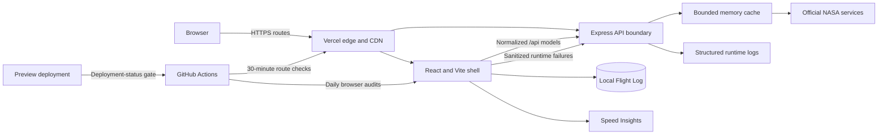

# Production architecture

Trust changes are explicit: NASA response shapes and credentials remain behind
the server; normalized shared contracts cross into the client; private Flight
Log content stays local; and operations receive only bounded technical signals.
The edge can cache successful public NASA responses, while errors and health
responses are `no-store`. The service worker excludes every `/api` request.
