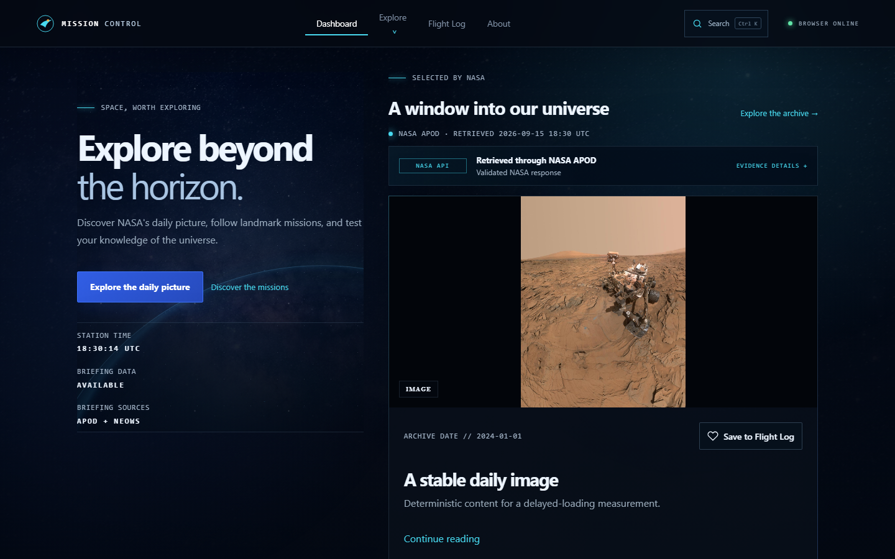
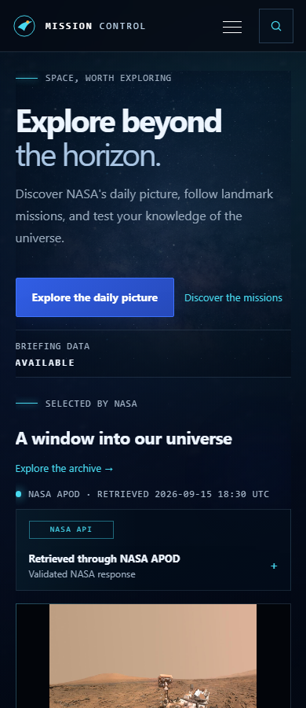

# Launch polish roadmap

This cycle refines existing features before promoting the site.

1. **Implemented: stronger first impression.** The desktop introduction sits beside the daily NASA picture, replacing the decorative orbit illustration. Clear introductory copy leads to one primary APOD action and a quieter Mission Archive link. Mobile stacks the introduction and image, with a compact data status. The image uses a stable frame without cropping; existing save, source, error, and video behavior remains available. Participant confirmation of first-impression clarity is pending phase 5.
2. **Planned: page composition.** Consistent content widths, image framing, typography, filters, and spacing throughout existing pages.
3. **Planned: interaction polish.** Refine selected, saved, loading, feedback, focus, and transition states.
4. **Planned: incoming-traffic readiness.** Review metadata, sharing previews, direct entry routes, deployed performance, and recovery behavior.
5. **Planned: participant validation and launch review.** Complete the outstanding real-user sessions, fix observed barriers, and verify the production revision before promotion.

## Phase 1 verification

Typecheck, lint, unit/component/accessibility tests, production build, and the production browser suite passed. Existing compressed asset budgets remain satisfied. The delayed-font/data fixture recorded zero CLS at 390px and 1440px after reserving the image frame. These are controlled measurements, not field-performance claims.

The [previous desktop layout](screenshots/loading-stability/desktop.png) shows the introduction above the picture. Updated deterministic captures show the desktop side-by-side composition and mobile stack; content fixtures differ, so these are layout evidence rather than image-quality comparisons.

No participant sessions were conducted during implementation. The existing [session guide](appearance-validation-phase-5.md) remains applicable; automated checks do not establish that unfamiliar visitors understand the site.
