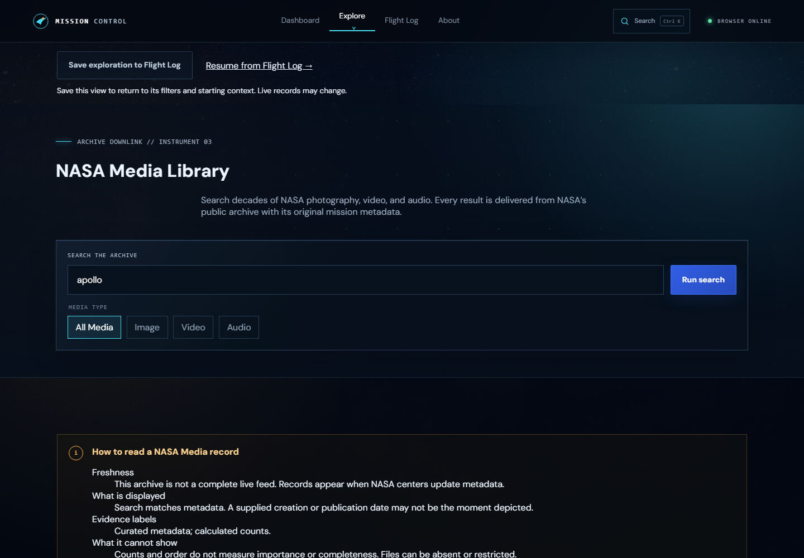
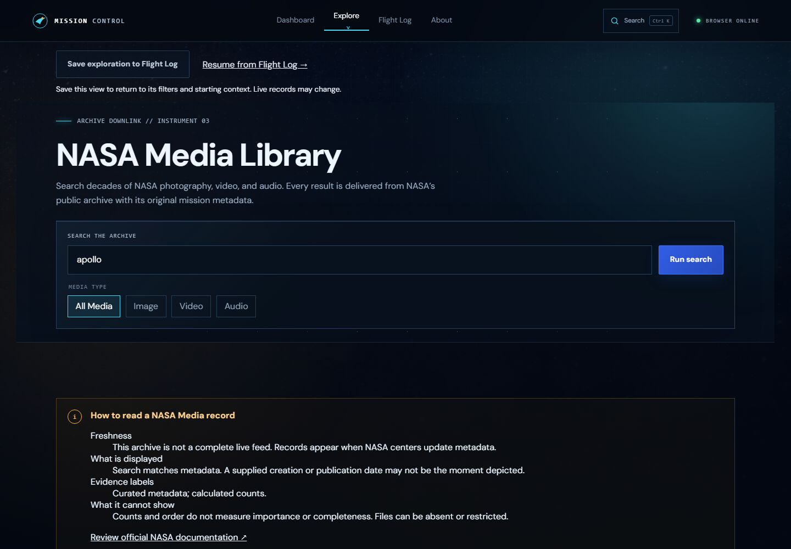
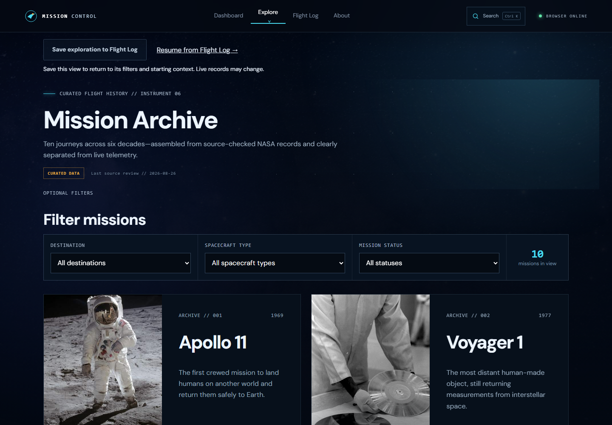
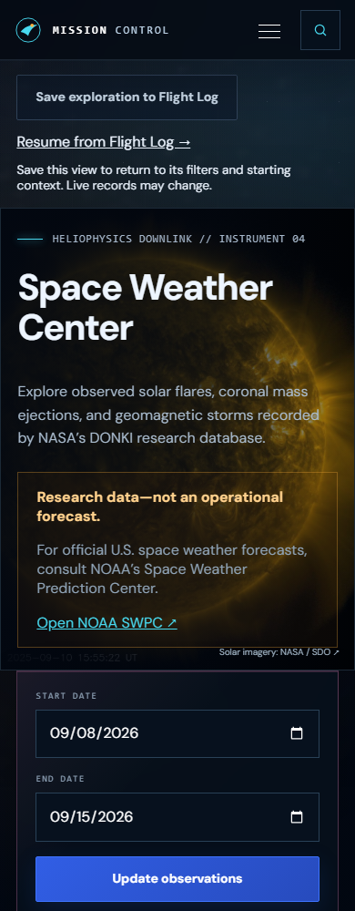

# Launch polish phase 2: page composition

Shared CSS now gives the eight main exploration and saved-content pages a consistent heading scale (2.5–4rem), line height, description measure, and spacing before controls. The Media Library's introduction no longer extends wider than its results or centers its description independently. Mission Archive and Trivia follow a single reading axis from title to description and filters. APOD uses contained imagery on desktop as well as mobile; letterboxing preserves portrait and landscape content without cropping.

Existing feature behavior, data integration, keyboard order, mission-card imagery, and the single-column homepage remain unchanged. Detail-page cinematic layouts retain their existing composition.

## Verification

- Typecheck, lint, unit/component/accessibility tests, production build, all 46 production browser tests, and compressed asset budgets passed.
- Captured eight routes at 1440px and 390px with fresh browser contexts. No horizontal overflow or uncaught JavaScript errors were reported. [Raw results](page-composition-results.json).
- Capture fixtures deliberately return unavailable API states to isolate introduction and control layout. Loaded-content flows are covered by the browser suite; APOD also received a loaded-image visual check at desktop and high-density mobile sizes.
- APOD still selects the standard preview and retains the full-resolution link. No additional image requests or dependencies were introduced.

Reproduce the layout capture after `npm run build`:

```sh
node scripts/capture-page-composition.mjs artifacts/page-composition
```

## Visual evidence

Media Library before:



Media Library after:







These are maintainer checks, not participant research. First-impression and task-completion validation remains planned for launch phase 5.
